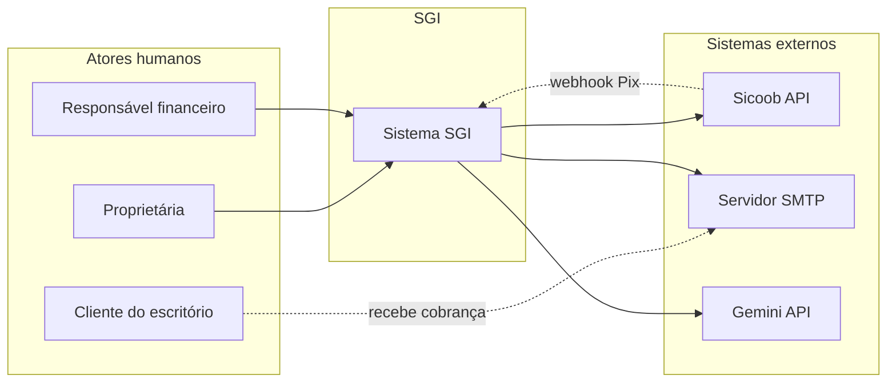
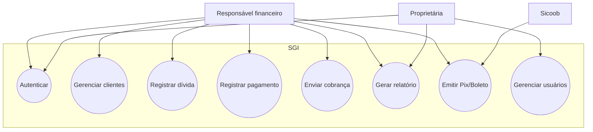
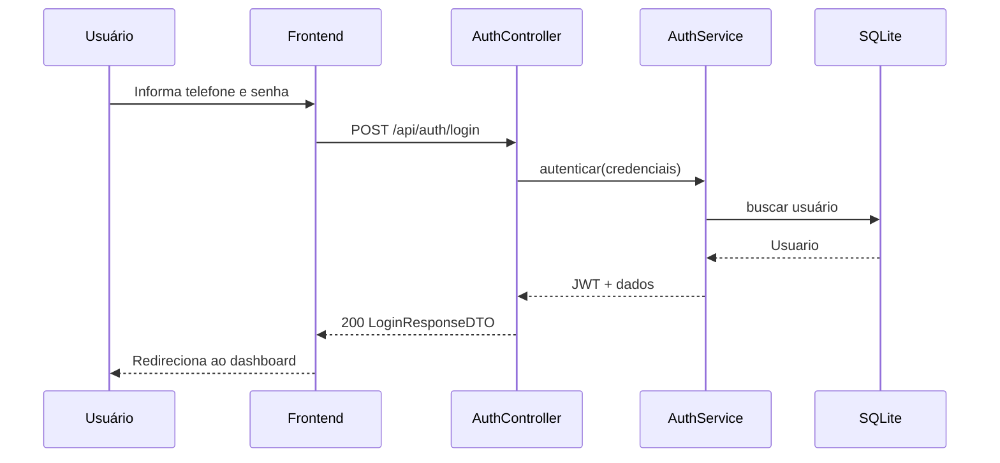
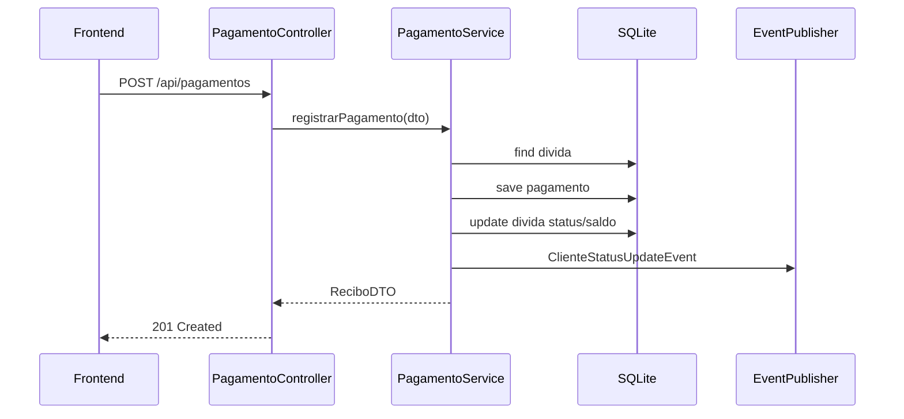
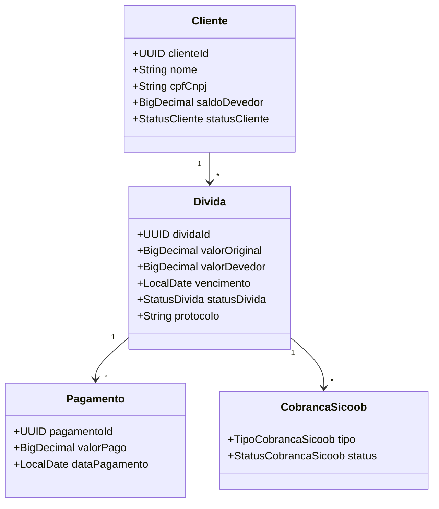
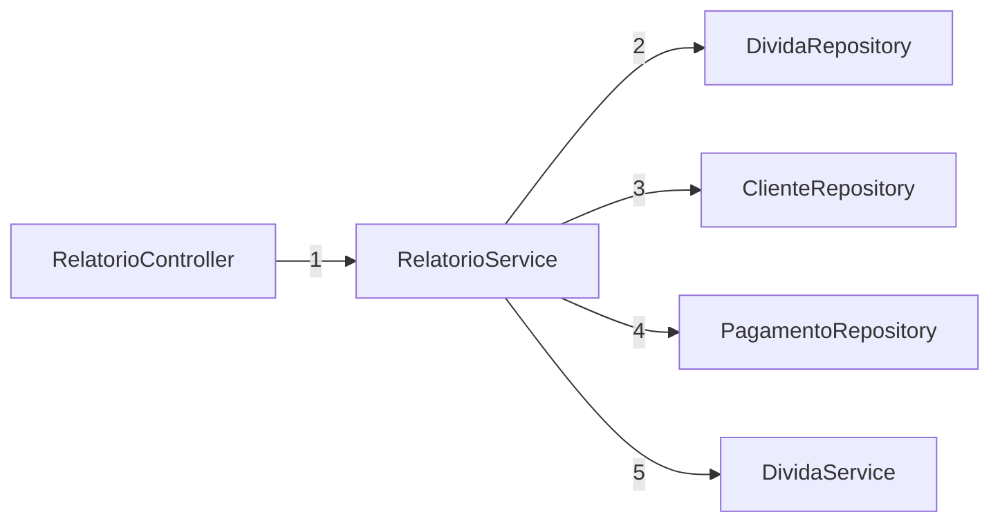
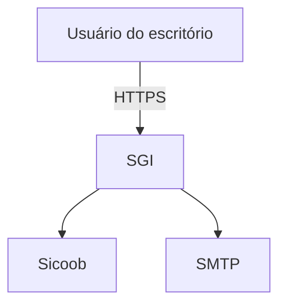
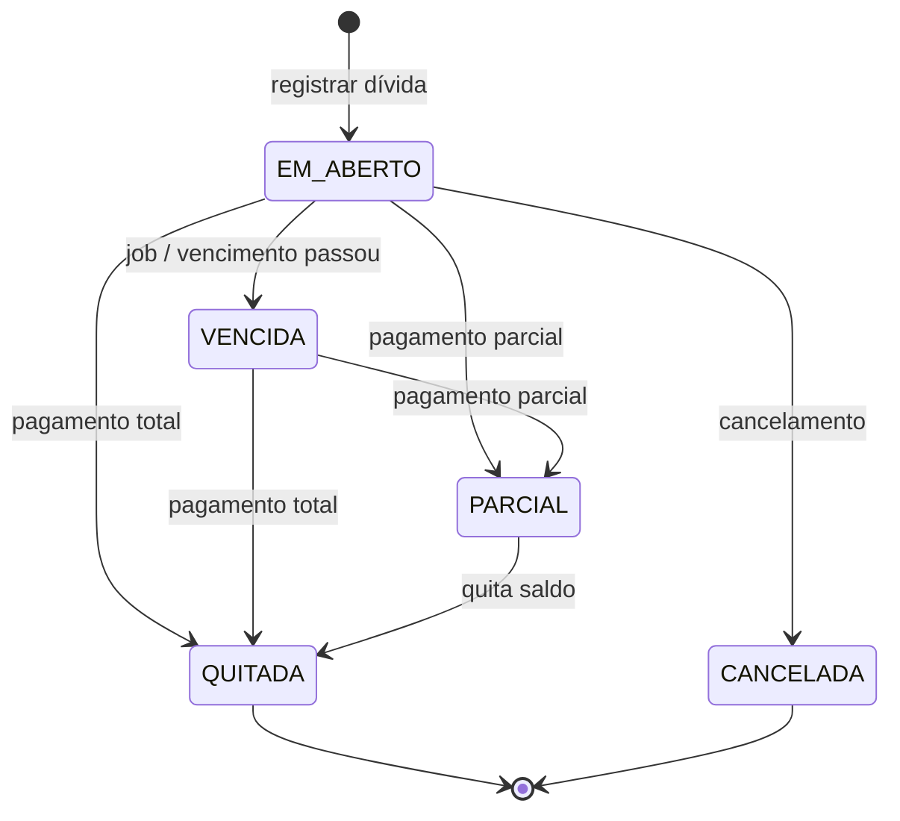
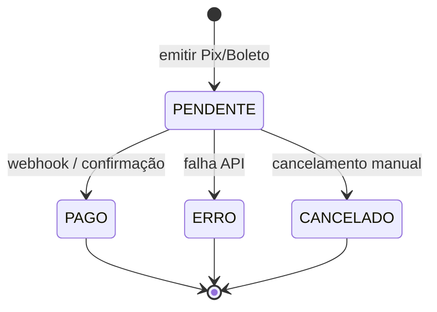
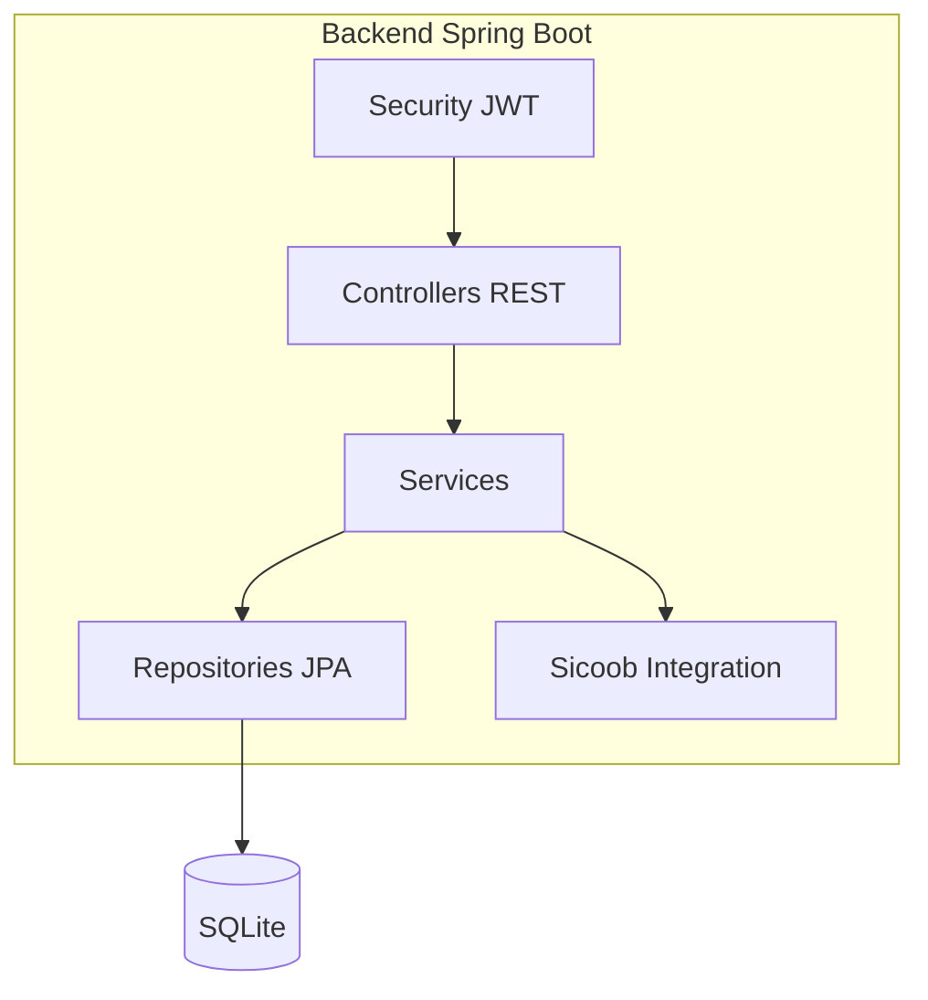

# Documentação de Projeto de TCC

**Título do trabalho:** [Ex.: SGI — Sistema de Gerenciamento de Inadimplentes para Escritórios de Contabilidade]  
**Autor:** [Seu nome completo]  
**Orientador(a):** [Nome do orientador]  
**Curso:** [Ex.: Ciência da Computação / Engenharia de Software]  
**Instituição:** PUC Minas  
**Ano/Semestre:** [Ex.: 2025/2]

> **Como usar este documento:** cada seção contém texto de exemplo (placeholder) indicando **o que deve ser preenchido**, **como preencher** e **referências ao projeto SGI** quando aplicável. Substitua os trechos entre colchetes `[...]` pelo conteúdo definitivo do seu TCC.

---

## 1. Introdução

### 1.1 Contexto e motivação

**O que preencher aqui:** apresente o cenário real que motivou o projeto. Descreva o problema de negócio, quem é afetado e por que uma solução computacional é necessária.

**Exemplo / placeholder:**

> Escritórios de contabilidade de pequeno e médio porte frequentemente enfrentam dificuldades no acompanhamento de clientes inadimplentes: planilhas dispersas, cobranças manuais por e-mail, falta de visão consolidada de saldos e atrasos. Esse cenário aumenta o risco de perda de receita e sobrecarrega a equipe administrativa.
>
> O **SGI (Sistema de Gerenciamento de Inadimplentes)** foi concebido para centralizar o cadastro de clientes, o registro de dívidas e pagamentos, a automação de cobranças e a geração de relatórios gerenciais, apoiando a gestão financeira do escritório de forma integrada.

### 1.2 Problema de pesquisa

**O que preencher:** formule a pergunta central ou o problema que o TCC busca resolver.

**Placeholder:**

> *Como desenvolver um sistema web que permita ao escritório de contabilidade gerenciar inadimplência de clientes de forma eficiente, com rastreabilidade de cobranças, cálculo de juros/multa e integração com meios de pagamento?*

### 1.3 Objetivos

**O que preencher:** objetivo geral + 3 a 5 objetivos específicos, mensuráveis quando possível.

| Tipo | Exemplo (placeholder) |
|------|------------------------|
| **Geral** | Desenvolver um sistema web para gestão de inadimplentes em escritórios de contabilidade. |
| **Específico 1** | Modelar e implementar cadastro de clientes, dívidas e pagamentos. |
| **Específico 2** | Automatizar envio de cobranças por e-mail e agendamentos. |
| **Específico 3** | Disponibilizar relatórios e exportação (PDF/Excel). |
| **Específico 4** | Integrar cobrança Pix/Boleto via API Sicoob (modo mock/produção). |
| **Específico 5** | Validar a solução com testes automatizados e implantação em ambiente cloud. |

### 1.4 Justificativa e relevância

**O que preencher:** por que o tema importa academicamente e profissionalmente; cite tendências (digitalização contábil, Pix, Open Finance, etc.) se relevante.

### 1.5 Escopo e limitações

**O que preencher:** o que **está** e **não está** no escopo.

**Placeholder — dentro do escopo:**
- Backend REST (Spring Boot), frontend web, SQLite, JWT, relatórios, e-mail, integração Sicoob (mock).

**Placeholder — fora do escopo / limitações:**
- Migração para PostgreSQL em produção (futuro).
- App mobile nativo.
- Integração contábil completa com ERPs de terceiros.

### 1.6 Estrutura deste documento

**O que preencher:** um parágrafo listando as seções seguintes e o propósito de cada uma (pode copiar/adaptar o sumário deste arquivo).

---

## 2. Modelos de Usuário e Requisitos

### 2.1 Descrição de Atores

**O que preencher:** liste todos os **atores** (humanos ou sistemas externos) que interagem com o SGI. Para cada ator, descreva: papel, responsabilidades, frequência de uso e sistemas que utiliza.

| Ator | Descrição | Interações principais |
|------|-----------|------------------------|
| **Proprietária do escritório** | Dono(a) do negócio; visão gerencial e controle de usuários | Dashboard, relatórios, gestão de acessos |
| **Responsável financeiro** | Operacionaliza cobranças, cadastros e pagamentos | Clientes, dívidas, pagamentos, notificações |
| **Cliente do escritório** | Devedor; não acessa o sistema diretamente (ator secundário) | Recebe e-mails de cobrança; paga via Pix/boleto |
| **Sistema Sicoob** | API bancária externa | Emissão de Pix/boleto; webhook de confirmação |
| **Servidor SMTP** | Envio de e-mails | Entrega de cobranças e lembretes |
| **Google Gemini** | API de IA (opcional) | Consultas sobre reforma tributária |

**Diagrama sugerido (UML — atores):**

> **Instrução:** substitua ou complemente atores conforme seu frontend e regras de negócio finais. Remova atores não implementados.

---

### 2.2 Modelos de Usuários (personas, perfis ou mapas de empatia)

**O que preencher:** escolha **pelo menos uma** abordagem (persona, perfil de acesso ou mapa de empatia) para cada tipo de usuário **que acessa o sistema**.

#### 2.2.1 Personas (exemplo)

**Persona 1 — Carla, proprietária**

| Campo | Conteúdo (placeholder) |
|-------|-------------------------|
| Idade / formação | 45 anos, contadora, dona do escritório |
| Objetivo | Reduzir inadimplência e ter visão do caixa a receber |
| Frustração | Planilhas desatualizadas; não sabe quem cobrar primeiro |
| Uso do sistema | Relatórios, ranking de devedores, gestão de usuários |
| Perfil no sistema | `PROPRIETARIA` |

**Persona 2 — Ricardo, responsável financeiro**

| Campo | Conteúdo (placeholder) |
|-------|-------------------------|
| Idade / formação | 28 anos, auxiliar administrativo |
| Objetivo | Registrar pagamentos e enviar cobranças rapidamente |
| Frustração | Retrabalho ao calcular juros manualmente |
| Uso do sistema | CRUD clientes/dívidas, pagamentos, e-mails |
| Perfil no sistema | `RESPONSAVEL_FINANCEIRO` |

#### 2.2.2 Perfis de acesso (implementados no SGI)

| Perfil | Permissões (placeholder — detalhe no TCC) |
|--------|-------------------------------------------|
| `PROPRIETARIA` | Acesso total; listar/revogar usuários; todas as funcionalidades |
| `RESPONSAVEL_FINANCEIRO` | Operacional; sem gestão de usuários |

#### 2.2.3 Mapa de empatia (template)

**O que preencher:** para uma persona, complete:

- **Pensa e sente:** [Ex.: preocupação com fluxo de caixa]
- **Ouve:** [Ex.: clientes pedindo prazo]
- **Vê:** [Ex.: muitas faturas vencidas]
- **Fala e faz:** [Ex.: liga para devedores, usa planilha]
- **Dores:** [Ex.: falta de tempo, erros manuais]
- **Ganhos:** [Ex.: cobrança automática, relatório em um clique]

> **Instrução:** inclua figura do mapa de empatia no PDF final do TCC (Figma, Miro ou Canva).

---

### 2.3 Modelo de Casos de Uso e Histórias de Usuários

**O que preencher:** (a) diagrama de casos de uso UML; (b) tabela de casos de uso; (c) histórias de usuário no formato ágil.

#### 2.3.1 Diagrama de casos de uso (placeholder)

#### 2.3.2 Especificação de casos de uso (template)

**CU-01 — Registrar pagamento**

| Item | Descrição |
|------|-----------|
| **Ator principal** | Responsável financeiro |
| **Pré-condições** | Usuário autenticado; dívida existente com saldo > 0 |
| **Fluxo principal** | 1. Seleciona dívida → 2. Informa valor e data → 3. Sistema registra pagamento → 4. Atualiza saldo e status → 5. Emite recibo |
| **Fluxos alternativos** | 3a. Valor maior que saldo → exibe erro de regra de negócio |
| **Pós-condições** | Pagamento persistido; dívida `PARCIAL` ou `QUITADA`; saldo do cliente recalculado |
| **Regras de negócio** | Valor em centavos; valor pago ≤ saldo devedor |

> **Instrução:** repita este template para os casos de uso prioritários (cadastrar cliente, enviar cobrança, emitir Pix, etc.).

#### 2.3.3 Histórias de usuário (exemplos)

| ID | História | Critério de aceite (placeholder) |
|----|----------|-----------------------------------|
| US-01 | Como responsável financeiro, quero registrar um pagamento para abater o saldo da dívida | Dado uma dívida de R$ 100, quando pago R$ 40, então saldo restante é R$ 60 e status é PARCIAL |
| US-02 | Como proprietária, quero ver ranking de maiores devedores | Lista ordenada por saldo; exportável |
| US-03 | Como responsável financeiro, quero enviar cobrança por e-mail | E-mail HTML enviado; registro em notificações |
| US-04 | Como responsável financeiro, quero emitir Pix para uma dívida | Retorna QR/copia e cola; cobrança persistida |
| US-05 | Como proprietária, quero revogar acesso de um usuário | Usuário passa a INATIVO; não autentica |

#### 2.3.4 Requisitos funcionais e não funcionais

**Funcionais (RF):** [RF-01] Cadastro de clientes; [RF-02] Registro de dívidas; …  
**Não funcionais (RNF):** [RNF-01] Autenticação JWT; [RNF-02] API REST JSON; [RNF-03] Tempo de resposta < 3s em operações comuns; [RNF-04] Deploy em Docker/Render.

> **Instrução:** numerar todos os RF/RNF e rastrear até casos de teste (seção 5).

---

### 2.4 Diagrama de Sequência do Sistema e Contrato de Operações

**O que preencher:** diagramas de sequência para fluxos críticos + tabela de contrato da API (endpoints, métodos, payloads, códigos HTTP).

#### 2.4.1 Diagrama de sequência — Login (placeholder)

#### 2.4.2 Diagrama de sequência — Registrar pagamento (placeholder)

#### 2.4.3 Contrato de operações (template)

Documente cada operação relevante. Exemplo:

**Operação:** `POST /api/pagamentos`

| Campo | Valor |
|-------|-------|
| **Descrição** | Registra pagamento parcial ou total de uma dívida |
| **Autenticação** | Bearer JWT |
| **Request body** | `PagamentoDTO`: `dividaId`, `valorPago` (centavos), `dataPagamento`, `metodoPagamento`, `comprovante` |
| **Respostas** | `201` ReciboDTO; `404` dívida não encontrada; `422` valor inválido; `401` não autenticado |
| **Efeitos colaterais** | Atualiza `valorDevedor`, `statusDivida`, publica evento de recálculo do cliente |

> **Instrução:** inclua contratos para `/api/clientes`, `/api/dividas`, `/api/relatorios/*`, `/api/sicoob/*`. Referência técnica: Swagger (`/swagger-ui.html`) e `DOCUMENTACAO-COMPLETA.md`.

---

## 3. Modelos de Projeto

### 3.1 Diagrama de Classes

**O que preencher:** diagrama UML de classes do **domínio** (entidades, enums, relacionamentos). Não é obrigatório incluir DTOs e controllers no diagrama principal — pode haver diagrama de domínio e diagrama de camadas separados.

**Classes principais do SGI (placeholder):**

| Classe | Atributos relevantes | Relacionamentos |
|--------|----------------------|-----------------|
| `Cliente` | nome, cpfCnpj, email, saldoDevedor, statusCliente | 1 — * `Divida` |
| `Divida` | valorOriginal, valorDevedor, vencimento, statusDivida, protocolo | * — 1 `Cliente`; 1 — * `Pagamento` |
| `Pagamento` | valorPago, dataPagamento, metodoPagamento | * — 1 `Divida` |
| `Usuario` | telefone, senha, perfil, statusUsuario | — |
| `CobrancaSicoob` | tipo, status, pixTxid, linha digitável | * — 1 `Divida` |
| `NotificacaoEmail` | assunto, corpo, statusEnvio | * — 1 `Cliente` |

> **Instrução:** exporte diagrama em alta resolução (PlantUML, StarUML, draw.io) para o anexo do TCC.

---

### 3.2 Diagramas de Sequência

**O que preencher:** sequências detalhadas por **caso de uso** ou **módulo** (além das da seção 2.4). Sugestão de fluxos:

| # | Fluxo | Participantes |
|---|-------|---------------|
| DS-01 | Enviar cobrança por e-mail | Frontend, NotificacaoController, NotificationService, SMTP |
| DS-02 | Emitir Pix Sicoob (mock) | SicoobController, SicoobCobrancaService, SicoobPixClient |
| DS-03 | Webhook Pix recebido | SicoobWebhookController, SicoobWebhookService, PagamentoService |
| DS-04 | Gerar relatório PDF | RelatorioController, RelatorioService, OpenPDF |

> **Instrução:** cada diagrama deve ter legenda, numeração de mensagens e notas para tratamento de erro.

---

### 3.3 Diagramas de Comunicação (colaboração)

**O que preencher:** diagramas UML de comunicação (alternativa ao de sequência), enfatizando **relações estruturais** entre objetos em um fluxo.

**Exemplo — colaboração no módulo de relatórios (placeholder):**

> **Instrução:** use a notação UML oficial de diagrama de comunicação se exigido pelo orientador; o diagrama acima é ilustrativo.

---

### 3.4 Arquitetura (UML ou C4 Model)

**O que preencher:** visão arquitetural em níveis. Recomenda-se **C4 Model** (Contexto → Contêineres → Componentes).

#### Nível 1 — Contexto (placeholder)

#### Nível 2 — Contêineres (placeholder)

| Contêiner | Tecnologia | Responsabilidade |
|-----------|------------|------------------|
| Frontend | React + TypeScript | Interface web |
| Backend API | Spring Boot 3.2 / Java 21 | Regras de negócio, REST, JWT |
| Banco de dados | SQLite | Persistência |
| Deploy | Docker + Render | Hospedagem backend |

#### Nível 3 — Componentes do backend (placeholder)

Camadas: **Controller** → **Service** → **Repository** → **Entity**; integrações em `integration.sicoob`; config em `config`.

> **Instrução:** inclua diagrama de deployment (Render + Vercel) referenciando `DEPLOY-RENDER.md`.

---

### 3.5 Diagramas de Estados

**O que preencher:** máquinas de estado para entidades com ciclo de vida relevante.

#### Estado da dívida (`StatusDivida`)

#### Estado da cobrança Sicoob (`StatusCobrancaSicoob`)

> **Instrução:** documente gatilhos, ações na transição e quem dispara cada mudança (usuário, job agendado, webhook).

---

### 3.6 Diagrama de Componentes e Implantação

**O que preencher:** (a) componentes internos e dependências; (b) nós de implantação (servidores, portas, volumes).

#### Componentes (placeholder)

#### Implantação (placeholder — produção)

| Nó | Ambiente | Artefato | Observação |
|----|----------|----------|------------|
| Render Web Service | Produção | Docker image (JAR) | Perfil `prod`, health `/health` |
| Disco persistente Render | Produção | `/var/data/sgi.db` | SQLite persistente |
| Vercel | Produção | Frontend estático | `VITE_API_URL` apontando para Render |
| localhost | Desenvolvimento | `mvn spring-boot:run` | SQLite em `Backend/data/` |

> **Instrução:** inclua diagrama UML de implantação com ícones de servidor, protocolo HTTPS e variáveis de ambiente principais (`JWT_SECRET`, `CORS_ALLOWED_ORIGINS`, `SICOOB_*`).

---

## 4. Glossário e Modelos de Dados

### 4.1 Glossário

**O que preencher:** termos do domínio contábil/financeiro e técnicos usados no TCC.

| Termo | Definição |
|-------|-----------|
| **Inadimplente** | Cliente com dívidas em aberto, parcialmente pagas ou vencidas |
| **Dívida** | Obrigação financeira registrada contra um cliente (honorários, serviços) |
| **Protocolo** | Identificador único da dívida (ex.: `DIV-20260531-ABC12345`) |
| **Saldo devedor** | Soma dos valores ainda não quitados (armazenado em centavos) |
| **Aging** | Relatório que classifica dívidas por faixa de atraso (0–30, 31–60 dias…) |
| **Pix copia e cola** | String para pagamento instantâneo via Pix |
| **JWT** | Token de autenticação stateless usado na API |
| **Webhook** | Callback HTTP do Sicoob ao confirmar pagamento Pix |
| **Soft delete** | Exclusão lógica (cliente `INATIVO` permanece no banco) |

> **Instrução:** acrescente siglas do escritório parceiro e termos da reforma tributária se forem escopo do TCC.

### 4.2 Modelo de dados lógico

**O que preencher:** DER ou diagrama entidade-relacionamento com cardinalidades, PKs, FKs e tipos.

**Tabelas principais (placeholder):**

| Tabela | PK | FKs | Observação |
|--------|----|----|------------|
| `cliente` | cliente_id | — | cpf_cnpj único |
| `divida` | divida_id | cliente_id | protocolo único |
| `pagamento` | pagamento_id | divida_id | valor em centavos |
| `usuario` | usuario_id | — | telefone único (login) |
| `cobranca_sicoob` | cobranca_id | divida_id | Pix ou Boleto |
| `notificacao_email` | notificacao_id | cliente_id | histórico de envios |
| `servico` | servico_id | — | catálogo de serviços |

### 4.3 Dicionário de dados (exemplo de atributo)

**Entidade:** `divida`

| Atributo | Tipo | Obrigatório | Descrição |
|----------|------|-------------|-----------|
| divida_id | UUID | Sim | Identificador |
| cliente_id | UUID | Sim | Cliente devedor |
| valor_original | DECIMAL | Sim | Valor inicial (centavos) |
| valor_devedor | DECIMAL | Sim | Saldo atual (centavos) |
| vencimento | DATE | Sim | Data de vencimento |
| status_divida | VARCHAR | Sim | EM_ABERTO, PARCIAL, QUITADA, VENCIDA, CANCELADA |
| protocolo | VARCHAR | Sim | Código único legível |

> **Instrução:** replique o dicionário para todas as entidades ou anexe como planilha. Referência: `DOCUMENTACAO-COMPLETA.md` seção Modelo de Dados.

### 4.4 Políticas de integridade e convenções

**Placeholder:**

- Valores monetários armazenados em **centavos** (inteiro/BigDecimal sem casas).
- Datas de vencimento padrão via `VencimentoUtil` (ex.: dia 4 do mês).
- Status de dívida em aberto: `EM_ABERTO`, `PARCIAL`, `VENCIDA` (método `StatusDivida.emAberto()`).

---

## 5. Casos de Teste

**O que preencher:** plano de testes rastreável aos requisitos (RF/US). Inclua testes unitários, de API e manuais.

### 5.1 Estratégia de testes

| Nível | Ferramenta | Escopo |
|-------|------------|--------|
| Unitário | JUnit 5 + Mockito | Services, utils |
| API (slice) | `@WebMvcTest` + MockMvc | Controllers REST |
| Integração | [Opcional] `@SpringBootTest` | Fluxo com banco |
| Manual | Swagger / frontend | Validação E2E |

### 5.2 Matriz de rastreabilidade (exemplo)

| ID teste | Requisito | Descrição | Resultado esperado |
|----------|-----------|-----------|-------------------|
| CT-01 | US-01 / RF pagamento | Pagamento parcial | Status PARCIAL; saldo reduzido |
| CT-02 | US-01 | Pagamento acima do saldo | HTTP 422 |
| CT-03 | US-04 | Emitir Pix mock | HTTP 201; pixCopiaECola preenchido |
| CT-04 | RNF JWT | Acesso sem token | HTTP 401 |
| CT-05 | US-02 | Relatório resumo | totalClientes consistente |

### 5.3 Casos de teste detalhados (template)

**CT-01 — Pagamento parcial**

| Campo | Valor |
|-------|-------|
| **Pré-condição** | Dívida com saldo 10.000 centavos (R$ 100,00) |
| **Passos** | 1. POST `/api/pagamentos` com valorPago=3000 |
| **Pós-condição** | saldo 7000; status PARCIAL; recibo retornado |
| **Automatizado** | `PagamentoServiceTest.registrar_pagamentoParcial` |

**CT-06 — Exportação PDF**

| Campo | Valor |
|-------|-------|
| **Passos** | GET `/api/relatorios/exportar/pdf?relatorio=inadimplentes` |
| **Esperado** | HTTP 200; Content-Type PDF; bytes > 0 |
| **Automatizado** | `RelatorioServiceTest.exportarPdf` |

### 5.4 Registro de execução (placeholder)

| Data | Versão | Total testes | Passou | Falhou | Responsável |
|------|--------|--------------|--------|--------|-------------|
| [DD/MM/AAAA] | 1.0.0 | 87 | 87 | 0 | [Nome] |

> **Instrução:** anexe print do `mvn test` e checklist de testes manuais do orientador/escritório parceiro.

---

## 6. Cronograma e Processo de Implementação

### 6.1 Metodologia de desenvolvimento

**O que preencher:** abordagem utilizada (cascata, ágil, híbrida), justificativa e práticas (Git, branches, code review, TDD parcial).

**Placeholder:**

> Foi adotada abordagem **iterativa/incremental**, com entregas quinzenais alinhadas ao calendário acadêmico: modelagem → backend core → frontend → integrações (e-mail, Sicoob) → deploy → testes → documentação final.

### 6.2 Fases do projeto

| Fase | Entregas | Status |
|------|----------|--------|
| 1. Levantamento e modelagem | Atores, casos de uso, DER | [ ] |
| 2. Backend core | Clientes, dívidas, pagamentos, JWT | [ ] |
| 3. Notificações e relatórios | E-mail, PDF, Excel, dashboard | [ ] |
| 4. Integrações | Sicoob mock, Gemini, reforma tributária | [ ] |
| 5. Frontend | Telas principais integradas à API | [ ] |
| 6. Deploy e testes | Render, Vercel, suíte automatizada | [ ] |
| 7. Monografia e banca | Texto final, slides, demonstração | [ ] |

### 6.3 Cronograma (Gantt simplificado — placeholder)

| Atividade | M1 | M2 | M3 | M4 | M5 | M6 |
|-----------|----|----|----|----|----|-----|
| Requisitos e UML | ██ | | | | | |
| Backend | | ██ | ██ | | | |
| Frontend | | | ██ | ██ | | |
| Integração Sicoob | | | | ██ | | |
| Testes + deploy | | | | | ██ | |
| Escrita TCC | | ██ | ██ | ██ | ██ | ██ |

> **Instrução:** substitua meses pelas datas reais do seu calendário PUC (qualificação, entrega parcial, banca).

### 6.4 Processo de implementação (fluxo de trabalho)

**Placeholder:**

1. **Issue/tarefa** definida a partir de história de usuário  
2. **Branch** `feature/nome` no Git  
3. **Implementação** backend/frontend + testes  
4. **Pull request** / revisão pelo orientador ou par  
5. **Merge** em `main` e deploy automático (Render/Vercel)  
6. **Documentação** atualizada (`docs/`)

### 6.5 Riscos e mitigação

| Risco | Impacto | Mitigação |
|-------|---------|-----------|
| Atraso na API Sicoob real | Médio | Modo mock (`sicoob.mock=true`) |
| Cold start Render free | Baixo | Plano pago ou health check periódico |
| Escopo tributário amplo | Alto | Delimitar módulo IBS/CBS ao essencial |

### 6.6 Evidências de conclusão

**O que preencher:** links e artefatos finais.

- Repositório: `[URL GitHub TCC]`
- Backend produção: `[URL Render]`
- Frontend produção: `[URL Vercel]`
- Swagger: `[URL]/swagger-ui.html`
- Documentação técnica: `Backend/docs/DOCUMENTACAO-COMPLETA.md`

---

## Anexos sugeridos

| Anexo | Conteúdo |
|-------|----------|
| A | Diagramas UML em alta resolução |
| B | DER completo |
| C | Lista completa de endpoints (OpenAPI export) |
| D | Manual do usuário (capturas de tela) |
| E | Termo de consentimento / dados do escritório parceiro (se aplicável) |

---

## Referências (placeholder)

> Preencher conforme ABNT — exemplos de tipos de referência a incluir:
>
> - Spring Boot Documentation. Oracle / VMware, 2024.  
> - BACEN. Manual do Pix. 2020.  
> - Sicoob Developers. Portal de APIs. 2025.  
> - Fowler, M. **C4 Model**. 2018.  
> - Material das disciplinas de Engenharia de Software / TCC da PUC Minas.

---

*Documento gerado como template para o TCC — SGI. Revise com o orientador antes da versão final da monografia.*
